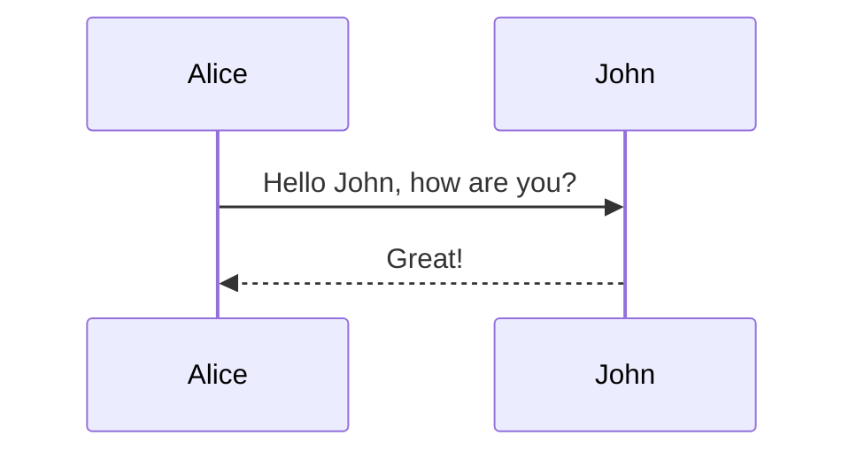

# 予約システム設計

## 要件定義

### 必須項目

- 申請書を記入された状態で印刷

- ログイン・ログアウト認証（メールアドレスを登録）

- 予約システム
  - カレンダー表示
  - 予約キャンセル
  - 予約承認後、予約状況を反映（承認いらないかも）
  - ユーザー自身の予約状況を確認
  - リマインドメール機能
  - 1時間単位の予約

### 任意項目

- 施設ごとに予約できる日時やエリアの区分等のパーツを組み換えてサイト作成できるもの

- オンライン決済

- 備品の貸し出し予約

- レビューメール

### 備考

- ユーザーの予約可能な上限・下限は決めた方が良い
  - 想定されたデータのみ入るように

## 外部設計

